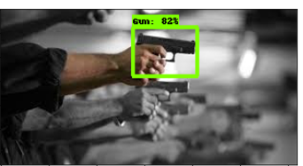

#                             Tensorflow 2.x Object Detection Tutorial on Weapon Dataset

>### Authors: Mr. Ali shafique, Zafar Iqbal, Aftab Karim, Ayesha Afzal, Bushra Hafeez

This blog has been written by the students of Artificial Intelligence Research Group under the supervision of Mr. Ali Shafique in the Department of Electrical Engineering 
at University of Engineering and Technology Lahore. In this blog Efficient-d0 model has been trained on weapon dataset.

  

In this tutorial we will learn how to train object detection model using TensorFlow 2 object detection API. TensorFlow 2 object detection API has been released on 10th July
2020 with lots of improvements as compared to the TensorFlow version 1. There has been a lot of new deep learning models with better computational speed and Mean Average 
Precision (mAP) on COCO Dataset. We will use Google Collaboratory to train the model, using the free GPU server and then export the trained model. In this tutorial we will 
use weapon dataset. This tutorial includes all the necessary code cells to train the model for object detection. We have got a great deal of help from
https://tensorflow-object-detection-api-tutorial.readthedocs.io/en/latest/. You can learn more about this notebook on medium article by following this link ___.

>## Resources:
- TensorFlow 2 object detection API tutorial, https://tensorflow-object-detectionapi-tutorial.readthedocs.io/en/latest/.
- Custom dataset preparation for object detection tutorial by Moses Olafenwa, [Object Detection Training — Preparing your custom dataset](https://medium.com/deepquestai/object-detection-training-preparing-your-custom-dataset-6248679f0d1d)
- Weapon dataset link, https://sci2s.ugr.es/weapons-detection
- TensorFlow model repository on github, https://github.com/tensorflow/models.
- TensorFlow records tutorial by Thomas Gamauf, https://medium.com/mostlyai/tensorflow-records-what-they-are-and-how-to-use-them-c46bc4bbb564.
- TensorFlow 2 object detection model zoo, [Tensorflow 2 model zoo](https://github.com/tensorflow/models/blob/master/research/object_detection/g3doc/tf2_detection_zoo.md)
- Tensorboard tutorial, https://neptune.ai/blog/tensorboard-tutorial
